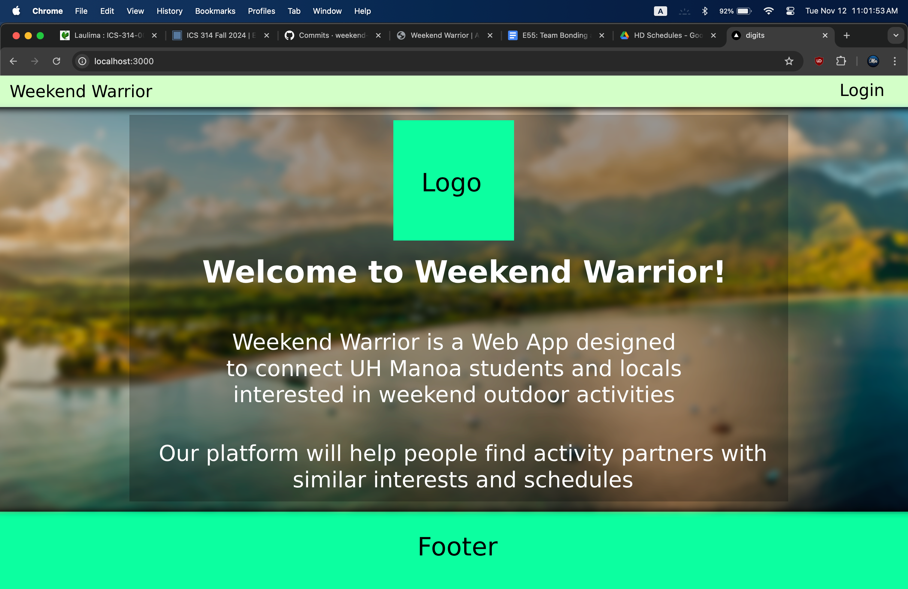
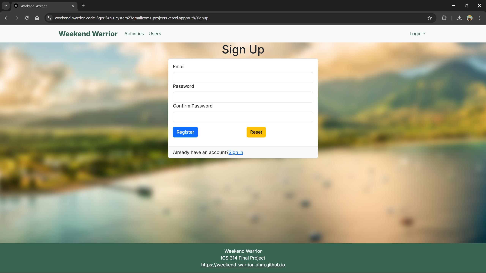
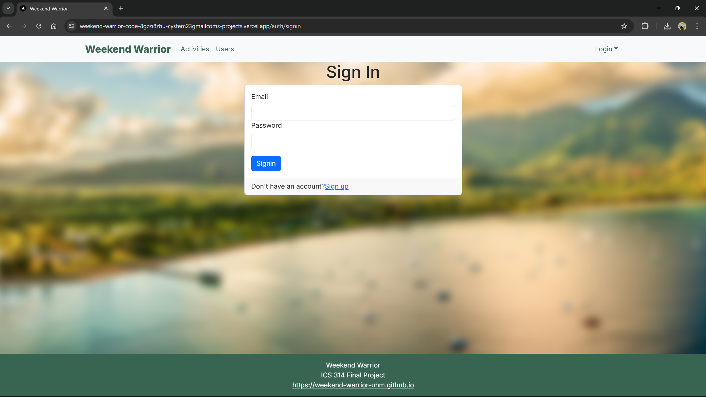
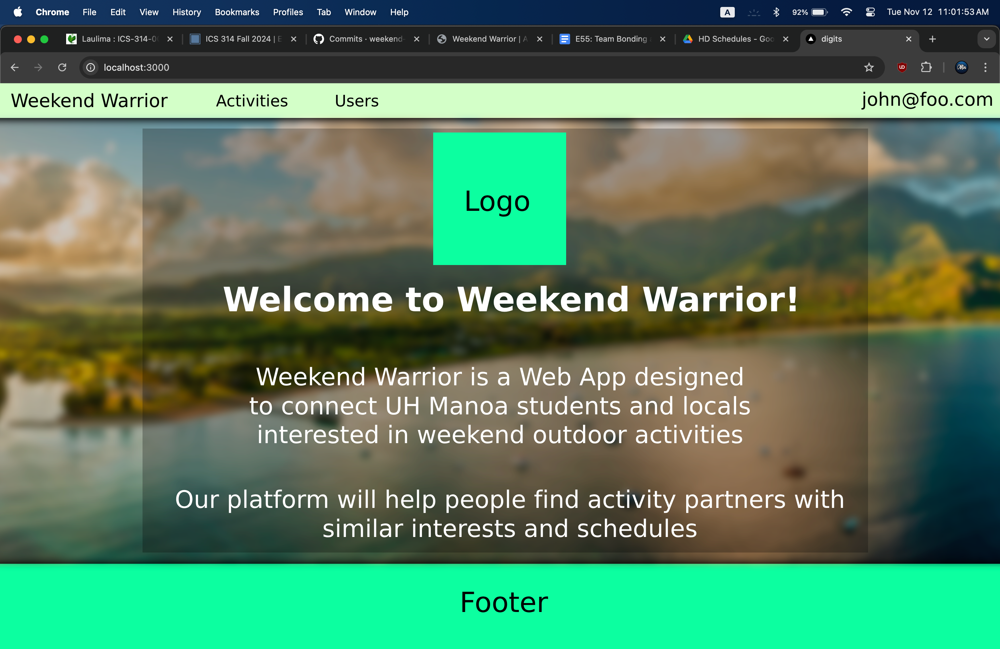
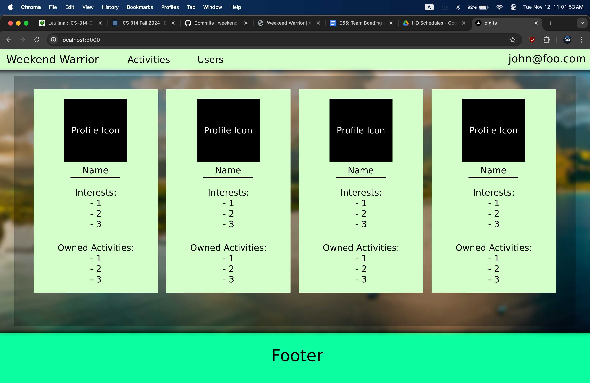
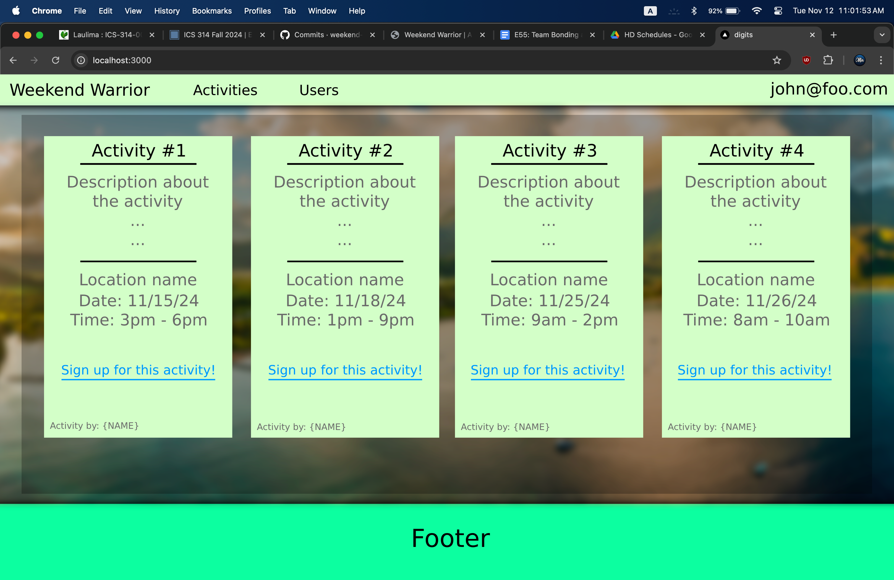

<div style="display: flex; justify-content: center; align-items: center; height: 100%; padding: 20px;">
  
</div>

## Table of contents

- [Overview](#overview)
- [Project Goals](#project-goals)
- [Group Contract](#group-contract)
- [GitHub Organization ](#github-organization)
- [Development History](#development-history)
- [Vercel Deployment](#vercel-deployment)
- [Community Feedback](#community-feedback)
- [User Guide](#user-guide)
- [Installation Instructions](#installation-instructions)
- [Meet The Team](#meet-the-team)


## Overview
Many UH Manoa students and locals have a hard time finding people with similar interests to join them in outdoor activities and hobbies. Whether it’s hiking, beach outings, surfing, or just hanging out, it’s not always easy to find partners or groups that align with specific plans or schedules.

Weekend Warrior is a platform that allows users to post their upcoming weekend plans or desired activities and connect with others interested in joining them. This app would serve as a local meetup spot for casual and activity-based connections. It will also make it easier to find activity buddies and plan for fun weekends.

## Project Goals

- Users can create or find activities to join.
- Admins ensure content safety and platform use.

## Group Contract
Click <a href="https://docs.google.com/document/d/11WCz0wKi_EQwpVjwTQwwox7MkSHgHivBXGg_-en4Drg/edit?tab=t.0">here</a> to view our group contract.

## GitHub Organization 
Click <a href="https://github.com/weekend-warrior-uhm">here</a> to view the Weekend Warrior project repository.

## Development History
The development process for Weekend Warrior conformed to Issue Driven Project Management practices. In a nutshell:

The development consists of a sequence of milestones, and each milestone is specified as a set of tasks. These tasks are then described using a GitHub Issue, and each issues is assigned to a single developer to complete. These tasks should typically consist of work that can be completed in 2-4 days. Furthermore, the work for each task is accomplished with a git branch named “issue-XX”, where XX is replaced by the issue number. When a task is complete, its corresponding issue is closed and its corresponding git branch is merged into the master branch. The state (todo, in progress, complete) of each task for a milestone is managed using a GitHub Project Board.

The following sections document the development history of Weekend Warrior.

### Milestone 1

Decide on a theme, layout and structure for the landing page.

- Description
- Sign up
- Login/Sign out
- Landing and Home pages




Click <a href="https://github.com/orgs/weekend-warrior-uhm/projects/1/views/1">here</a> to view M1 Project page.

### Milestone 2

- Activity Posts
- Administrative Privileges
- Read/Write
- Search/Browse Activities
- Removal of expired activities


Click <a href="https://github.com/orgs/weekend-warrior-uhm/projects/1/views/1">here</a> to view M2 Project page.

### Milestone 3

- Implement user-friendly design
- Logo
- Background
- Colors

## Vercel Deployment 
Click <a href="https://weekend-warrior-code-8gzzi8zhu-cystem23gmailcoms-projects.vercel.app//">here</a> to view Weekend Warrior deployed on Vercel.

## Community Feedback
We are interested in your experience using Weekend Warrior! If you would like, please take a couple of minutes to fill out the <a href="https://docs.google.com/forms/d/e/1FAIpQLSdrWeETfYEjw8oqLx-X0x7NTqaUBytmYJ4bCKiufgvyK1YpMg/viewform?usp=sf_link">Weekend Warrior Feedback Form</a>. It contains only five short questions and will help us understand how to improve the system.


## User Guide

### Landing Page

When you first bring up the application, you will see the landing page that provides a brief introduction to Weekend Warrior:


 
### Register
If you do not yet have an account on the system, you can register by clicking on “Login,” then “Sign Up:”




### Sign in
Click on the Login link to bring up the Sign In page which allows you to log in:




### User home page
After successfully logging in, the system takes you to your home page. It is just like the landing page, but the NavBar contains links to Activities and Users:




### List Users
Clicking on the Users link brings up a page that lists all of the users associated with the logged in user:



### List Activities 
Clicking on the Activities link brings up a page that lists all activites posted by other users, along with each activity's description, location and scheduled time. Users also have the option to sign up for any activity that interests them:



### Admin mode
It is possible to designate one or more users as “Admins” through the settings file. When a user has the Admin role, they get access to a special NavBar link that retrieves a page listing all Contacts associated with all users:


-->

## Installation Instructions

First, [install PostgreSQL](https://www.postgresql.org/download/). Then create a database for the application.

```

$ createdb weekend-warrior
Password: <password>
$

```

Second, go to [[https://github.com/weekend-warrior-uhm/weekend-warrior-code](https://github.com/weekend-warrior-uhm/weekend-warrior-code)](https://github.com/weekend-warrior-uhm/weekend-warrior-code), and download the code. Create a new repository using the source code installed on your system.

Third, cd into the directory of your local copy of the repo, and install third party libraries with:

```

$ npm install

```

Fourth, create a `.env` file from the `sample.env`. Set the `DATABASE_URL` variable to match your PostgreSQL database that you created in the first step. See the Prisma docs [Connect your database](https://www.prisma.io/docs/getting-started/setup-prisma/add-to-existing-project/relational-databases/connect-your-database-typescript-postgresql). Then run the Prisma migration `npx prisma migrate dev` to set up the PostgreSQL tables.

```

$ npx prisma migrate dev
Environment variables loaded from .env
Prisma schema loaded from prisma/schema.prisma
Datasource "db": PostgreSQL database "<your database name>", schema "public" at "localhost:5432"

Applying migration `20240708195109_init`

The following migration(s) have been applied:

migrations/
└─ 20240708195109_init/
└─ migration.sql

Your database is now in sync with your schema.

✔ Generated Prisma Client (v5.16.1) to ./node_modules/@prisma/client in 51ms

$

```

Then seed the database with the `/config/settings.development.json` data using `npx prisma db seed`.

```

$ npx prisma db seed
Environment variables loaded from .env
Running seed command `ts-node --compiler-options {"module":"CommonJS"} prisma/seed.ts` ...
Seeding the database
Creating user: admin@foo.com with role: ADMIN
Creating user: john@foo.com with role: USER


🌱 The seed command has been executed.
$

```

## Running the system

Once the libraries are installed and the database seeded, you can run the application by invoking the "dev" script in the package.json file

```

$ npm run dev

> nextjs-application-template-1@0.1.0 dev
> next dev

▲ Next.js 14.2.4

- Local: http://localhost:3000
- Environments: .env

✓ Starting...
✓ Ready in 1619ms

```

### Viewing the running app

If all goes well, the template application will appear at [http://localhost:3000](http://localhost:3000). You can login using the credentials in settings.development.json, or else register a new account.

### ESLint

You can verify that the code obeys our coding standards by running ESLint over the code in the src/ directory with:

```
$ npm run lint

> nextjs-application-template-1@0.1.0 lint
> next lint

✔ No ESLint warnings or errors
$
```


<!-- 
### Add Contacts
From the Home page or List Contacts page, the user can click the "Add Contact" link to bring up a page that allows them to enter new contact information. This page includes fields for the contact's first and last names, address, image, and description. After filling out the form, the user can save the new contact, which will then appear in the list of contacts.


### Edit Contacts
From the List Contacts page, the user can click the “Edit” link associated with any Contact to bring up a page that allows that Contact information to be edited:


-->

## Meet The Team

<div style="display: flex; flex-wrap: wrap; justify-content: space-between;">

  <!-- First Person -->
  <div style="flex: 1; padding: 10px; min-width: 250px;">
    <h2>Nigel Arias</h2>
    
    <p style="margin-top: 10px;">
      Contact info: <br>
       - Email: narias8@hawaii.edu<br>
      <a href="https://nwarias003.github.io/">Portfolio</a>
    </p>
  </div>

  <!-- Second Person -->
  <div style="flex: 1; padding: 10px; min-width: 250px;">
    <h2>Sean Flynn</h2>
    
    <p style="margin-top: 10px;">
      Contact info: <br>
       - Email: sflynn7@hawaii.edu<br>
      <a href="https://seanhflynn.github.io/">Portfolio</a>
    </p>
  </div>

  <!-- Third Person -->
  <div style="flex: 1; padding: 10px; min-width: 250px;">
    <h2>Min Jun Han</h2>
    
    <p style="margin-top: 10px;">
      Contact info: <br>
       - Email: minjun@hawaii.edu<br>
      <a href="https://min-808.github.io/">Portfolio</a>
    </p>
  </div>

  <!-- Fourth Person -->
  <div style="flex: 1; padding: 10px; min-width: 250px;">
    <h2>Mhar Olipani</h2>
    
    <p style="margin-top: 10px;">
      Contact info: <br>
       - Email: mhar@hawaii.edu<br>
      <a href="https://mharolipani.github.io/">Portfolio</a>
    </p>
  </div>

</div>


