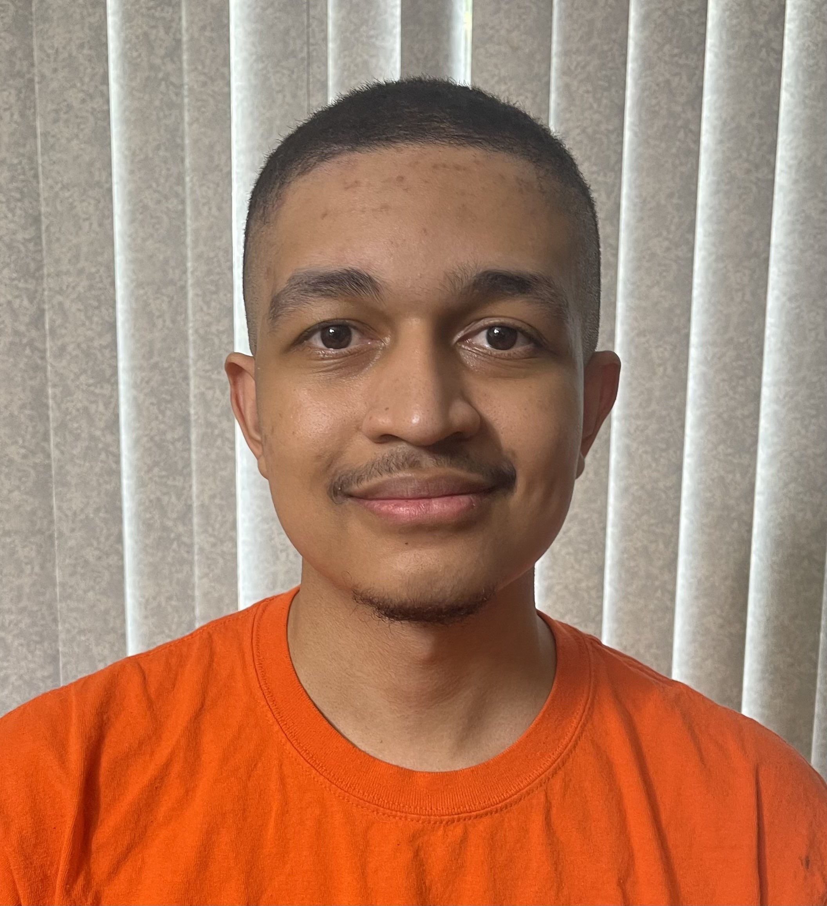

## Table of contents

- [Overview](#overview)
- [Project Goals](#project-goals)
- [Group Contract](#group-contract)
- [Milestone 1](#milestone-1)
- [Milestone 2](#milestone-2)
- [Milestone 3](#milestone-3)
- [Vercel Deployment](#vercel-deployment)
- [Project Mockups](#project-mockups)
- [Meet The Team](#meet-the-team)

## Overview
Many UH Manoa students and locals have a hard time finding people with similar interests to join them in outdoor activities and hobbies. Whether it’s hiking, beach outings, surfing, or just hanging out, it’s not always easy to find partners or groups that align with specific plans or schedules.

Weekend Warrior is a platform that allows users to post their upcoming weekend plans or desired activities and connect with others interested in joining them. This app would serve as a local meetup spot for casual and activity-based connections. It will also make it easier to find activity buddies and plan for fun weekends.

## Project Goals

- Users can create or find activities to join.
- Admins ensure content safety and platform use.

## Group Contract
Click <a href="https://docs.google.com/document/d/11WCz0wKi_EQwpVjwTQwwox7MkSHgHivBXGg_-en4Drg/edit?tab=t.0">here</a> to view our group contract.

## Milestone 1

Decide on a theme, layout and structure for the landing page.

- Description
- Sign up
- Login/Sign out
- Landing and Home pages

## Milestone 2

- Activity Posts
- Administrative Privileges
- Read/Write
- Search/Browse Activities
- Removal of expired activities

## Milestone 3

- Implement user-friendly design
- Logo
- Background
- Colors

## Vercel Deployment 
Click <a href="https://weekend-warrior-code-8gzzi8zhu-cystem23gmailcoms-projects.vercel.app//">here</a> to view Weekend Warrior deployed on Vercel.

## GitHub Repository
Click <a href="https://github.com/weekend-warrior-uhm/weekend-warrior-code">here</a> to view the Weekend Warrior repository.

## Project Mockups

### Landing Page

When you first bring up the application, you will see the landing page that provides a brief introduction to Weekend Warrior:

 
### Register
If you do not yet have an account on the system, you can register by clicking on “Login,” then “Sign Up:”

### Sign in
Click on the Login link to bring up the Sign In page which allows you to log in:

### User home page
After successfully logging in, the system takes you to your home page. It is just like the landing page, but the NavBar contains links to Activities and Users:

### List Users
Clicking on the Users link brings up a page that lists all of the users associated with the logged in user:

### List Activities 
Clicking on the Activities link brings up a page that lists all activites posted by other users, along with each activity's description, location and scheduled time. Users also have the option to sign up for any activity that interests them:

<!-- 
### Add Contacts
From the Home page or List Contacts page, the user can click the "Add Contact" link to bring up a page that allows them to enter new contact information. This page includes fields for the contact's first and last names, address, image, and description. After filling out the form, the user can save the new contact, which will then appear in the list of contacts.

### Edit Contacts
From the List Contacts page, the user can click the “Edit” link associated with any Contact to bring up a page that allows that Contact information to be edited:

### Admin mode
It is possible to designate one or more users as “Admins” through the settings file. When a user has the Admin role, they get access to a special NavBar link that retrieves a page listing all Contacts associated with all users:

-->

## Meet The Team

  <!-- First Person -->
  

    <h2>Nigel Arias</h2>
    
    

      <!-- [Add the description for the first person here.] -->
      <a href="https://nwarias003.github.io/">Portfolio</a>
    

  

  <!-- Second Person -->
  

    <h2>Sean Flynn</h2>
    
    

      <!-- [Add the description for the second person here.] -->
      <a href="https://seanhflynn.github.io/">Portfolio</a>
    

  

  <!-- Third Person -->
  

    <h2>Min Jun Han</h2>
    
    

      <!-- [Add the description for the third person here.] -->
      <a href="https://min-808.github.io/">Portfolio</a>
    

  

  <!-- Fourth Person -->
  

    <h2>Mhar Olipani</h2>
    
    

      <!-- [Add the description for the fourth person here.] -->
      <a href="https://mharolipani.github.io/">Portfolio</a>
    

  

