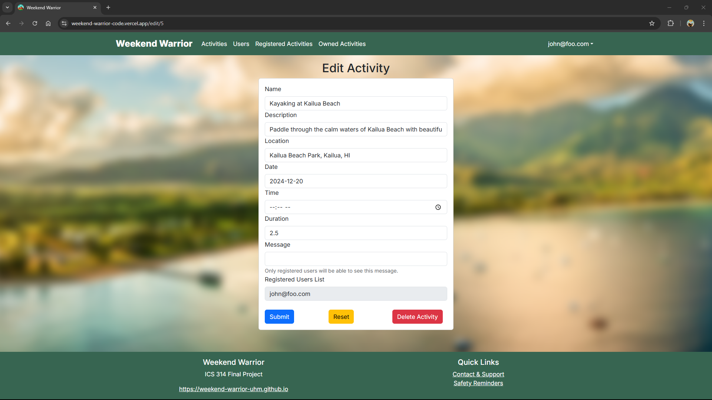

<!-- <link rel="stylesheet" href="style.css"> -->

<div style="display: flex; justify-content: center; align-items: center; height: 100%; padding: 20px;">
  
</div>

## Table of contents

- [Overview](#overview)
- [Project Goals](#project-goals)
- [Group Contract](#group-contract)
- [GitHub Organization ](#github-organization)
- [Continuous Integration](#continuous-integration)
- [Development History](#development-history)
- [Vercel Deployment](#vercel-deployment)
- [Community Feedback](#community-feedback)
- [User Guide](#user-guide)
- [Installation Instructions](#installation-instructions)
- [Meet The Team](#meet-the-team)


## Overview
Many UH Manoa students and locals have a hard time finding people with similar interests to join them in outdoor activities and hobbies. Whether it’s hiking, beach outings, surfing, or just hanging out, it’s not always easy to find partners or groups that align with specific plans or schedules.

Weekend Warrior is a platform that allows users to post their upcoming weekend plans or desired activities and connect with others interested in joining them. This app would serve as a local meetup spot for casual and activity-based connections. It will also make it easier to find activity buddies and plan for fun weekends.

## Project Goals

- Users can create or find activities to join.
- Admins ensure content safety and platform use.

## Group Contract
Click <a href="https://docs.google.com/document/d/11WCz0wKi_EQwpVjwTQwwox7MkSHgHivBXGg_-en4Drg/edit?tab=t.0">here</a> to view our group contract.


## GitHub Organization 
Click <a href="https://github.com/weekend-warrior-uhm">here</a> to view the Weekend Warrior project repository.

## Continuous Integration


Weekend Warrior uses [GitHub Actions](https://docs.github.com/en/actions) to automatically run ESLint and Playwright tests each time a commit is made to the default branch. You can see the results of all recent "workflows" at [https://github.com/weekend-warrior-uhm/weekend-warrior-code/actions](https://github.com/weekend-warrior-uhm/weekend-warrior-code/actions).

The workflow definition file is straightforward and is located at
[.github/workflows/ci.yml](https://github.com/weekend-warrior-uhm/weekend-warrior-code/blob/main/.github/workflows/ci.yml).


## Development History
The development process for Weekend Warrior conformed to Issue Driven Project Management practices. In a nutshell:

The development consists of a sequence of milestones, and each milestone is specified as a set of tasks. These tasks are then described using a GitHub Issue, and each issues is assigned to a single developer to complete. These tasks should typically consist of work that can be completed in 2-4 days. Furthermore, the work for each task is accomplished with a git branch named “issue-XX”, where XX is replaced by the issue number. When a task is complete, its corresponding issue is closed and its corresponding git branch is merged into the master branch. The state (todo, in progress, complete) of each task for a milestone is managed using a GitHub Project Board.

The following sections document the development history of Weekend Warrior.

### Milestone 1

Decide on a theme, layout and structure for the landing page.

- Description
- Sign up
- Login/Sign out
- Landing and Home pages


Click <a href="https://github.com/orgs/weekend-warrior-uhm/projects/1/views/1">here</a> to view M1 Project page.

### Milestone 2

- Activity Posts
- Administrative Privileges
- Read/Write
- Search/Browse Activities
- Removal of expired activities


Click <a href="https://github.com/orgs/weekend-warrior-uhm/projects/4/views/1">here</a> to view M2 Project page.

### Milestone 3

- Implement user-friendly design
- Logo
- Background
- Colors


Click <a href="https://github.com/orgs/weekend-warrior-uhm/projects/5/views/1">here</a> to view M3 Project page.

## Vercel Deployment 
Click <a href="https://weekend-warrior-code-sigma.vercel.app">here</a> to view Weekend Warrior deployed on Vercel.

## Community Feedback
We are interested in your experience using Weekend Warrior! If you would like, please take a couple of minutes to fill out the <a href="https://docs.google.com/forms/d/e/1FAIpQLSdrWeETfYEjw8oqLx-X0x7NTqaUBytmYJ4bCKiufgvyK1YpMg/viewform?usp=sf_link">Weekend Warrior Feedback Form</a>. It contains only five short questions and will help us understand how to improve the system.


## User Guide

### Landing Page

When you first bring up the application, you will see the landing page that provides a brief introduction to Weekend Warrior:


 
### Register
If you do not yet have an account on the system, you can register by clicking on “Login,” then “Sign Up.” On the Sign Up page, users can create an account by providing their email, a username, password (with confirmation), full name, phone number, gender, and interests. The interests field allows users to input activities or hobbies, separated by commas, that help personalize their profile. After filling out the form, users can click the Register button to submit their information or the Reset button to clear the form:


### Sign in
Click on the Login link to bring up the Sign In page which allows you to log in:


### Edit User Information
In order to change your account's information, click on your email in the top-right corner of the navigation bar and select "Edit Info". This will bring up the Edit User Information page, where you can update your account details, including email, username, full name, phone number, gender, and interests. Once you've made your desired changes, click Save Changes to update your information or Reset to clear the form fields:


### User home page
After successfully logging in, the system takes you to your home page. It is just like the landing page, but the NavBar contains links to Activities and Users:


### List Activities 
Clicking on the Activities link brings up a page that lists all activities posted by users, along with each activity's description, location, scheduled time, and the total number of registered participants. Users have the option to Sign Up for activities they are interested in, Unregister from activities they have previously joined, or Report activities if necessary. Additionally, creators of an activity are provided options to Edit/Delete their own activity. At the top of the page, users can click on the Create Activity button to add a new activity to the list:


### Report Activity
When users click the Report button on an activity card, a Report Activity form appears in a modal window. The form is pre-filled with the Activity Name and the Activity Creator for convenience. Users are required to provide a brief message describing the issue in the Report field, with a maximum limit of 500 characters. After typing their report, users can submit it by clicking Submit Report or close the form without submitting by clicking the Close button. This streamlined process ensures that users can quickly and efficiently report any concerns related to activities:


### List Users
Clicking on the Users link brings up a page that lists all users in the system. Each user is displayed in a card format that includes their gender, interests, and role (e.g., USER or ADMIN). This page provides an overview of the user base while keeping personal details, such as email, full name, and phone number, hidden for privacy:


### Registered Activities
Clicking on the Registered Activities link displays a page that lists all activities you have signed up for. Each activity is presented in a card format, showing its description, location, date, time, duration, activity owner, and the total number of registered users. You can choose to Unregister from an activity, view additional details by clicking "Activity Info", or "Report" an activity if necessary:


### Owned Activities
Clicking on the Owned Activities link displays a page that lists all activities you have created. Each activity is shown in a card format with its description, location, date, time, duration, and total number of registered users. As the creator, you have the option to Edit/Delete the activity, view additional details by clicking Activity Info, or Unregister if needed:


### Edit Activity
Clicking on the Edit/Delete button for an activity brings up the Edit Activity page, where activity creators can modify the details of their activity. This page allows users to update the activity name, description, location, date, time, duration, and a message for registered participants. Once changes are made, users can click Submit to save updates, Reset to clear changes, or Delete Activity to permanently remove the activity:




### Activity Info
Clicking on the Activity Info button displays a detailed view of the selected activity. This page provides additional information, including a welcome message, the list of registered users, and a contact link to the activity organizer for any inquiries. The activity owner can post a message for participants and provide follow-up updates, which are visible only to registered users:


### Admin mode
It is possible to designate one or more users as “Admins” through the settings file. When a user has the Admin role, they gain access to a special Admin Panel, which can be found by clicking on their email in the top-right corner of the navigation bar and selecting "Admin" from the dropdown menu. This page displays two main sections: Activities and Users. The Activities section lists all currently created activities with details, including the name, description, location, date, time, duration, owner, registered users, and any messages associated with the activity. Admins can edit each activity by clicking the "Edit" link in the corresponding row. The Users section provides a table with user-specific information, such as email, username, full name, phone number, gender, interests, and role, allowing Admins to view all users in the system:


Admins are also able to edit and delete all the currently listed activities:


In addition, Admins can access the Report Panel by clicking on their email in the top-right corner of the navigation bar and selecting "Reports" from the dropdown menu. This page displays a table of all activity reports submitted by users. Each report entry includes the ID, Activity ID, Activity Name, Activity Author, and Report Text, which contains details about the issue provided by the user. This panel allows Admins to efficiently review reported activities, investigate user concerns, and take appropriate actions to resolve issues within the system:


### Contact & Support
Clicking on the Contact & Support link in the footer opens a page with helpful resources for users needing assistance. The page includes a “Contact Us” section that provides an email address and phone number for support inquiries. It also features a comprehensive FAQ section addressing common questions about account creation, activity participation, managing activities, and reporting issues. Additionally, the page offers links to essential resources, including the Community Guidelines, Privacy Policy, and Terms of Service, ensuring a safe and informed user experience:


### Safety Reminders
Clicking on the Safety Reminders link in the footer brings up a page that provides essential safety guidelines for users. The page includes General Safety Tips, such as meeting in public places, informing someone about your plans, and trusting your instincts if you feel uncomfortable. It also offers Activity-Specific Tips with advice for hiking, water activities, and cycling to ensure users stay safe during their activities. Additionally, the Emergency Preparedness section emphasizes the importance of planning ahead, carrying essential items like a first aid kit, and staying informed about weather updates and local advisories. For further details, the page includes links to the Community Guidelines, Privacy Policy, and Terms of Service to help users stay informed and protected:


## Installation Instructions

First, [install PostgreSQL](https://www.postgresql.org/download/). Then create a database for the application.

```

$ createdb weekend-warrior
Password: <password>
$

```

Second, go to [[https://github.com/weekend-warrior-uhm/weekend-warrior-code](https://github.com/weekend-warrior-uhm/weekend-warrior-code)](https://github.com/weekend-warrior-uhm/weekend-warrior-code), and download the code. Create a new repository using the source code installed on your system.

Third, cd into the directory of your local copy of the repo, and install third-party libraries with:

```

$ npm install

```

Fourth, create a `.env` file from the `sample.env`. Set the `DATABASE_URL` variable to match your PostgreSQL database that you created in the first step. See the Prisma docs [Connect your database](https://www.prisma.io/docs/getting-started/setup-prisma/add-to-existing-project/relational-databases/connect-your-database-typescript-postgresql). Then run the Prisma migration `npx prisma migrate dev` to set up the PostgreSQL tables.

```

$ npx prisma migrate dev
Environment variables loaded from .env
Prisma schema loaded from prisma/schema.prisma
Datasource "db": PostgreSQL database "<your database name>", schema "public" at "localhost:5432"

Applying migration `20240708195109_init`

The following migration(s) have been applied:

migrations/
└─ 20240708195109_init/
└─ migration.sql

Your database is now in sync with your schema.

✔ Generated Prisma Client (v5.16.1) to ./node_modules/@prisma/client in 51ms

$

```

Then seed the database with the `/config/settings.development.json` data using `npx prisma db seed`.

```

$ npx prisma db seed
Environment variables loaded from .env
Running seed command `ts-node --compiler-options {"module":"CommonJS"} prisma/seed.ts` ...
Seeding the database
Creating user: admin@foo.com with role: ADMIN
Creating user: john@foo.com with role: USER


🌱 The seed command has been executed.
$

```

## Running the system

Once the libraries are installed and the database seeded, you can run the application by invoking the "dev" script in the package.json file

```

$ npm run dev

> nextjs-application-template-1@0.1.0 dev
> next dev

▲ Next.js 14.2.4

- Local: http://localhost:3000
- Environments: .env

✓ Starting...
✓ Ready in 1619ms

```

### Viewing the running app

If all goes well, the template application will appear at [http://localhost:3000](http://localhost:3000). You can login using the credentials in settings.development.json, or else register a new account.

### ESLint

You can verify that the code obeys our coding standards by running ESLint over the code in the src/ directory with:

```
$ npm run lint

> nextjs-application-template-1@0.1.0 lint
> next lint

✔ No ESLint warnings or errors
$
```


<!-- 
### Add Contacts
From the Home page or List Contacts page, the user can click the "Add Contact" link to bring up a page that allows them to enter new contact information. This page includes fields for the contact's first and last names, address, image, and description. After filling out the form, the user can save the new contact, which will then appear in the list of contacts.


### Edit Contacts
From the List Contacts page, the user can click the “Edit” link associated with any Contact to bring up a page that allows that Contact information to be edited:


-->

## Meet The Team

<div style="display: flex; flex-wrap: wrap; justify-content: space-between;">

  <!-- First Person -->
  <div style="flex: 1; padding: 10px; min-width: 250px;">
    <h2>Nigel Arias</h2>
    
    <p style="margin-top: 10px;">
      Contact info: <br>
       - Email: narias8@hawaii.edu<br>
      <a href="https://nwarias003.github.io/">Portfolio</a>
    </p>
  </div>

  <!-- Second Person -->
  <div style="flex: 1; padding: 10px; min-width: 250px;">
    <h2>Sean Flynn</h2>
    
    <p style="margin-top: 10px;">
      Contact info: <br>
       - Email: sflynn7@hawaii.edu<br>
      <a href="https://seanhflynn.github.io/">Portfolio</a>
    </p>
  </div>

  <!-- Third Person -->
  <div style="flex: 1; padding: 10px; min-width: 250px;">
    <h2>Min Jun Han</h2>
    
    <p style="margin-top: 10px;">
      Contact info: <br>
       - Email: minjun@hawaii.edu<br>
      <a href="https://min-808.github.io/">Portfolio</a>
    </p>
  </div>

  <!-- Fourth Person -->
  <div style="flex: 1; padding: 10px; min-width: 250px;">
    <h2>Mhar Olipani</h2>
    
    <p style="margin-top: 10px;">
      Contact info: <br>
       - Email: mhar@hawaii.edu<br>
      <a href="https://mharolipani.github.io/">Portfolio</a>
    </p>
  </div>

</div>


